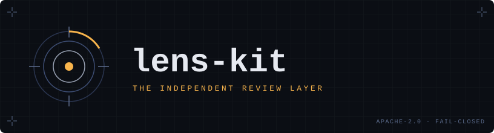
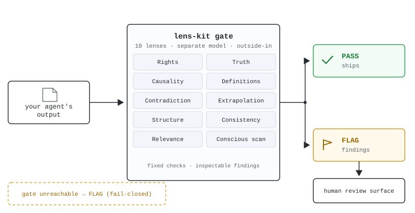
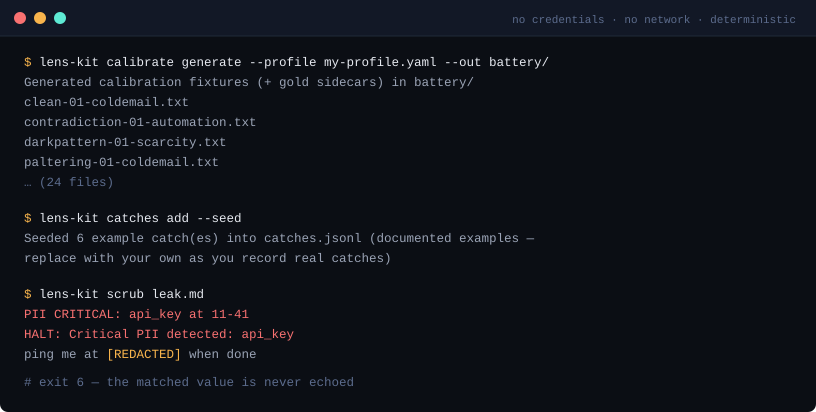

<p align="center">
  
</p>

<p align="center">
  <a href="LICENSE"></a>
  <a href="https://github.com/mrhpython/lens-kit/actions/workflows/ci.yml"></a>
  
  
  
</p>

<p align="center">
A separate model reviews your AI's output — fixed checks, inspectable findings, fail-closed.<br>
The independent review layer that catches confidently-wrong text before it ships.
</p>

<picture>
  <source media="(prefers-color-scheme: dark)" srcset="docs/assets/architecture-dark.svg">
  
</picture>

## See it work first (no install)

Paste text into the checker in your browser and read what comes back —
the flagged line, the reason, and which checks raised nothing:
**<https://soulfield.one/#try>** · five runs a day, no sign-up, no key.

Or call the same endpoint directly:

```bash
curl -s https://api.soulfield.one/v1/demo \
  -H 'content-type: application/json' \
  -d '{"text": "<the AI output you are about to ship>"}'
```

That hosted endpoint is the same lens set this repo runs; the difference is
whose keys and whose data. This kit is how you run it yourself. A run that
raises nothing means the checks found nothing they could name — it is not
clearance to publish.

## Why outside-in

A generator grading its own output is circular. lens-kit runs the review in a
**separate model you choose** — any litellm-compatible endpoint, or local
Ollama for free — against fixed lens signatures you can train on your own
labeled data. The result is `passed` / `per_lens` / `violations`, never a
self-reported grade. If the gate can't run, the answer is never PASS — it
fails closed.

## Quickstart

```bash
python -m pip install \
  "lens-kit @ git+https://github.com/mrhpython/lens-kit.git@v0.1.0"

# 1. No credentials, no network — the deterministic parts of the kit:
lens-kit calibrate generate --profile src/lens_kit/profiles/agency-example.yaml --out battery/
lens-kit catches add --seed          # seeds the institutional-memory loop
lens-kit scrub README.md             # deterministic PII pre-pass (exit 6 on a finding)

# 2. The actual gate. ONE model endpoint — any litellm target:
cp src/lens_kit/profiles/agency-example.yaml my-profile.yaml
echo 'Our Q3 revenue grew 40% year-over-year and will keep growing.' > report.md
lens-kit validate report.md --profile my-profile.yaml --json
```

## Install for your coding agent

Install the core once, then the adapter for the agent you use. These commands
are pinned to the GitHub release tag and do not require PyPI.

```bash
# Core (required by every adapter)
python -m pip install \
  "lens-kit @ git+https://github.com/mrhpython/lens-kit.git@v0.1.0"

# Codex
python -m pip install \
  "lens-codex-hook @ git+https://github.com/mrhpython/lens-kit.git@v0.1.0#subdirectory=integrations/codex"

# Claude Code
python -m pip install \
  "lens-stop-hook @ git+https://github.com/mrhpython/lens-kit.git@v0.1.0#subdirectory=integrations/claude-code"

# Grok
python -m pip install \
  "lens-grok-hook @ git+https://github.com/mrhpython/lens-kit.git@v0.1.0#subdirectory=integrations/grok"
```

The GitHub Release also carries wheels and source archives for the core and all
three adapters, plus `SHA256SUMS`. Configuration remains agent-specific:
[Codex](integrations/codex/README.md) ·
[Claude Code / Agent SDK](integrations/claude-code/README.md) ·
[Grok](integrations/grok/README.md).



Step 2 costs whatever your endpoint charges — set `llm.model` to
`ollama_chat/…` with `api_key_env:` omitted and it costs nothing and stays on
your machine. There is no bundled key and no default vendor: if the env var
named in your profile is unset, the kit refuses to run rather than silently
reaching for something else.

Thinking-capable models (Qwen3.x and similar) need the `extra_body` block in the
profile uncommented, or they spend the whole token budget reasoning and the gate
times out — which the kit reports as UNKNOWN, never as a pass.

```python
from lens_kit import LensGate, Profile, lm_context

profile = Profile.load("my-profile.yaml")
gate = LensGate(profile=profile)
with lm_context(profile):   # scoped LM override, restores on exit/exception
    result = gate(text=text, context="CFO audience, needs cost numbers")
result.passed, result.per_lens, result.violations
```

Process-global alternative: `lm, previous_lm = configure_from_profile(profile)`
— restore with `dspy.configure(lm=previous_lm)`. Prefer `lm_context` for
anything scoped (the compile and eval harnesses run inside it).

## Onboard with a coding agent

The repository ships an agent skill at [`skills/lens-kit/SKILL.md`](skills/lens-kit/SKILL.md)
that teaches Claude Code / Cursor / Codex the real CLI, the fail-closed
semantics, and the boundary rules. Paste this into your coding agent:

> Clone https://github.com/mrhpython/lens-kit, read skills/lens-kit/SKILL.md,
> and follow it: install the kit into a venv, run the no-credential
> quickstart, then set up a profile for my endpoint (or local Ollama) and run
> `lens-kit validate` on the file I give you. Show me the findings, including
> any check that returned UNKNOWN.

Starting from folders rather than code? The
[ICM Gated Starter](https://api.soulfield.one/kit) is a free, Apache-2.0 folder system for
one agent — map, desk, numbered stages — with this gate wired in as its verify stage
([repository](https://github.com/mrhpython/icm-gated-starter)).

## What's in the box

| Capability | What it does | Reference |
|---|---|---|
| **Gate** (`validate`) | 10-lens review of one document; structured verdict, fail-closed | [Run ledger + verdict semantics](docs/REFERENCE.md#run-ledger-runsmd) |
| **Train + eval** (`compile`, `eval`) | GEPA compile against your labels; frozen-holdout eval with variance envelopes and versioned receipts | [Training and evaluating](docs/REFERENCE.md#training-and-evaluating-c2) |
| **Costing gate** | Compile refuses to run past a projected spend/wall-clock threshold; pace monitor kills a run that blows the projection | [The costing gate](docs/REFERENCE.md#the-costing-gate-why-compile-can-refuse-to-run) |
| **Drift log** | Weekly re-score of a frozen holdout against a fixed anchor and a band set in advance; `OK` or `DRIFT`, no post-hoc judgement | [Our own weekly log, both tiers labelled](docs/WEEKLY-EVAL-LOG.md) |
| **Calibration** (`calibrate`) | Deterministic planted-flaw battery — prove the gate can FAIL the right things before trusting a PASS | [Calibrating the gate](docs/REFERENCE.md#calibrating-the-gate-c3) |
| **Mutation control** (`mutate`) | Seeded broken variants of your real holdout; a missed mutant fails the run and is named | [Mutation control](docs/REFERENCE.md#mutation-control--is-my-gate-actually-alive-c4) |
| **Label audit** (`label-audit`) | When gate and gold disagree, audit the gold before blaming the model | [Label audit](docs/REFERENCE.md#label-audit--audit-the-gold-before-you-blame-the-model-c4) |
| **Provenance sidecar** (`sidecar`) | Every metric travels with its evidence and an explicit `not_a_claim_of` list | [Provenance sidecar](docs/REFERENCE.md#provenance-sidecar--the-number-refuses-to-travel-past-its-evidence-c4) |
| **Review surface** (`review`) | Self-contained HTML page for human verdicts on the gate's verdicts | [Review surface](docs/REFERENCE.md#review-surface--put-a-human-in-front-of-the-verdicts-c5) |
| **Consistency checks** (`consistency`) | Cross-artifact tripwires, pure Python: marker parity, leak scan, number parity | [Consistency checks](docs/REFERENCE.md#consistency-checks-deterministic-no-llm) |
| **PII pre-pass** (`scrub`) | Deterministic secret/PII halt BEFORE any provider call — the secret never leaves your process | [PII pre-pass](docs/REFERENCE.md#pii-pre-pass--lens-0-deterministic-no-llm) |
| **Catches memory** (`catches`) | Institutional memory of named defects; recurring patterns get promoted to deterministic checks | [Catches](docs/REFERENCE.md#catches--the-institutional-memory-loop-no-llm) |
| **Stop-hook gates** | Gates a coding agent's finished answer. A non-Rights FAIL returns findings for one correction; unresolved internal low-risk output can be delivered with warnings, while public/high-risk output escalates. Rights HALT remains blocked. The validator is a separate model — the agent never grades itself. | [Codex](integrations/codex/README.md) · [Claude Code and Claude Agent SDK](integrations/claude-code/README.md) |
| **Validator agent** | Model-agnostic protocol for the cross-relationship tier above the gate | [The validator agent](docs/REFERENCE.md#the-validator-agent--the-cross-relationship-tier) |

Exit codes are load-bearing (`3` = too expensive to run, `5` = the gate missed
a planted flaw, `6` = a consistency tripwire fired):
[full table](docs/REFERENCE.md#exit-codes).

Also in the reference:
[rerun variance and the cache trap](docs/REFERENCE.md#rerun-variance-and-the-cache-trap) ·
[credentials and the `.env` footgun](docs/REFERENCE.md#credentials-and-the-env-footgun) ·
[extracted vs deferred (honesty table)](docs/REFERENCE.md#extracted-vs-deferred-honesty-table) ·
[increment history](docs/REFERENCE.md#increment-history-c1c5).

## The 10 lenses

rights (HALT gate) · truth · causality · definitionalIntegrity ·
contradiction · extrapolation · structure · consistency · relevance
(warning-only) · consciousScan (annotates, never blocks). The LLM signatures
detect generally; all deterministic suppression is driven by YOUR profile
vocabulary — an empty profile means pure LLM detection, never fewer true
positives. Full section: [the 10 canonical lenses](docs/REFERENCE.md#the-10-canonical-lenses).

## Provider-agnostic by design

Bring ANY litellm-compatible endpoint — xAI, OpenAI, Anthropic, Google,
self-hosted, or local Ollama. There is no fallback chain: a missing key or
model is a hard error, never a silent provider switch.
[Full text](docs/REFERENCE.md#provider-agnostic-by-design-full-text).

## Documentation

The methodology manual ships inside the kit under [`docs/`](docs/):

| Doc | What it covers |
|---|---|
| [`docs/MANUAL.md`](docs/MANUAL.md) | The training loop end to end — label → baseline → calibrate → compile (costing gate) → eval + variance → FN forensics → one bounded fix → mutation control → sidecar → ship. Each step: why, the exact command, the receipt, the failure it prevents. |
| [`docs/REFERENCE.md`](docs/REFERENCE.md) | The full CLI and workflow reference (everything that used to live on this page) |
| [`docs/CLAIMS.md`](docs/CLAIMS.md) | The honest-claims doctrine: evidence lanes, the five-field claim-promotion gate, `not_a_claim_of`, era-stamping + re-baseline on provider drift, and the score-transfer ban (numbers do not transfer — measure yours). |
| [`docs/WORKED-EXAMPLE.md`](docs/WORKED-EXAMPLE.md) | A real run retold as a tutorial: a version bump that *looked* like it broke the gate, the cache-collision proof that it didn't, the served-model substitution that did, and the two wrong conclusions the discipline blocked. |
| [`docs/VALIDATOR-AGENT.md`](docs/VALIDATOR-AGENT.md) | The validator-agent protocol — the model-agnostic 7-step loop (classify → read prior catches → run the gate → run cross-checks → name the downstream consequence → render the verdict receipt → append catches) on real kit commands, the boundary rules as agent instructions, and when to spend the agent tier at all. Drop-in system prompt: [`agent/validator-agent.md`](agent/validator-agent.md); receipt templates: [`agent/receipt-templates.md`](agent/receipt-templates.md). |

## Tests

No-network suite (stubbed predictors, no live API):

```bash
pip install -e ".[dev]"
pytest tests/
```

## Claims discipline

**This package makes no accuracy claims.** Not "low" ones — none.

Any figure you see in these docs is there to demonstrate the *method*, never to
sell the tool. Every one of them is an internal measurement on our own frozen
agency-domain holdout, taken on a stated date against a served model that has
since changed. They are **not independently verifiable from outside this repo**,
they carry **no transfer promise**, **no accuracy floor on your data**, and no
concurrency or scale claim. Treat them as a worked example of the discipline in
`docs/WORKED-EXAMPLE.md` — which exists precisely because one of our own numbers
moved by eleven points with no change to the code, the data, or the local stack.

If you want a number you can trust for your own use, the honest route is the one
this kit is built for: run it on your own material, against your own holdout,
and read the envelope it gives you. That figure is yours and it is the only one
that means anything about your domain.

## License

**Apache License, Version 2.0** — Copyright (c) 2026 Soulfield.

The grant is in [`LICENSE`](LICENSE) at the root of this package; [`NOTICE`](NOTICE)
carries the copyright notice and the third-party attribution. You may use, modify,
redistribute and train this kit on your own data under those terms.

The review surface is a modified derivative of Anthropic's eval-viewer
(Apache-2.0) — full attribution and change list:
[docs/REFERENCE.md](docs/REFERENCE.md#attribution-review-surface).
